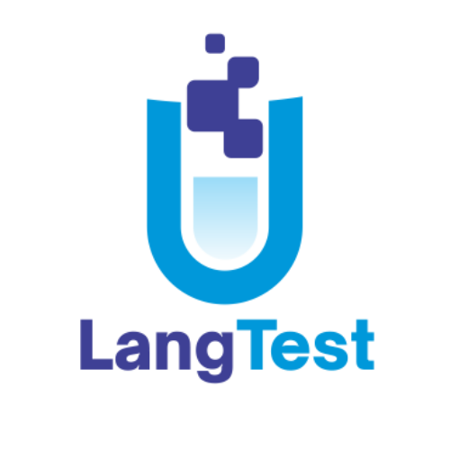
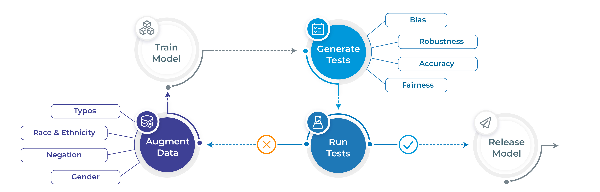

<p align="center">
  
</p>

<div align="center">
  <h1 style="text-align: center; vertical-align: middle;">LangTest: Deliver Safe & Effective Language Models</h1>
</div>

<p align="center">
    <a href="https://github.com/JohnSnowLabs/langtest/releases">
        
    </a>
    <a href="https://www.johnsnowlabs.com/responsible-ai-blog/">
        
    </a>
    <a href="https://langtest.org/docs/pages/docs/install">
        
    </a>
    <a href="https://star-history.com/#JohnSnowLabs/langtest">
        
    </a>
    <a href="https://github.com/JohnSnowLabs/langtest/issues">
        
    </a>
    <a href="https://pepy.tech/project/langtest">
        
    </a>
    <a href="https://github.com/JohnSnowLabs/langtest/actions/workflows/build_and_test.yml">
        
    </a>
    <a href="https://github.com/JohnSnowLabs/langtest/blob/master/LICENSE" alt="License">
        
    </a>
    <a href="CODE_OF_CONDUCT.md">
        
    </a>



<p align="center">
  <a href="https://langtest.org/">Project's Website</a> •
  <a href="#key-features">Key Features</a> •
  <a href="#how-to-use">How To Use</a> •
  <a href="#benchmark-datasets">Benchmark Datasets</a> •
  <a href="#community-support">Community Support</a> •
  <a href="#contributing-to-langtest">Contributing</a> •
  <a href="#mission">Mission</a> •
  <a href="#license">License</a>
</p>

## Project's Website

Take a look at our official page for user documentation and examples: [langtest.org](http://langtest.org/) 

## Key Features

- Generate and execute more than 60 distinct types of tests only with 1 line of code
- Test all aspects of model quality: robustness, bias, representation, fairness and accuracy.​
- Automatically augment training data based on test results (for select models)​
- Support for popular NLP frameworks for NER, Translation and Text-Classifcation: Spark NLP, Hugging Face & Transformers.
- Support for testing LLMS ( OpenAI, Cohere, AI21, Hugging Face Inference API and Azure-OpenAI LLMs) for question answering, toxicity, clinical-tests, legal-support, factuality, sycophancy, summarization and other popular tests. 

## Benchmark Datasets

LangTest comes with different datasets to test your models, covering a wide range of use cases and evaluation scenarios. You can explore all the benchmark datasets available [here](https://langtest.org/docs/pages/benchmarks/benchmark), each meticulously curated to challenge and enhance your language models. 
Whether you're focused on Question-Answering, text summarization etc, LangTest ensures you have the right data to push your models to their limits and achieve peak performance in diverse linguistic tasks.

## How To Use

```python
# Install langtest
!pip install langtest[transformers]

# Import and create a Harness object
from langtest import Harness
h = Harness(task='ner', model={"model":'dslim/bert-base-NER', "hub":'huggingface'})

# Generate test cases, run them and view a report
h.generate().run().report()
```

> **Note**
> For more extended examples of usage and documentation, head over to [langtest.org](https://www.langtest.org)

## Responsible Ai Blogs

You can check out the following LangTest articles:

| Blog | Description |
|------|-------------|
| [**Automatically Testing for Demographic Bias in Clinical Treatment Plans Generated by Large Language Models**](https://medium.com/john-snow-labs/automatically-testing-for-demographic-bias-in-clinical-treatment-plans-generated-by-large-language-ffcf358b6092) | Helps in understanding and testing demographic bias in clinical treatment plans generated by LLM. |
| [**LangTest: Unveiling & Fixing Biases with End-to-End NLP Pipelines**](https://www.johnsnowlabs.com/langtest-unveiling-fixing-biases-with-end-to-end-nlp-pipelines/) | The end-to-end language pipeline in LangTest empowers NLP practitioners to tackle biases in language models with a comprehensive, data-driven, and iterative approach. |
| [**Beyond Accuracy: Robustness Testing of Named Entity Recognition Models with LangTest**](https://medium.com/john-snow-labs/beyond-accuracy-robustness-testing-of-named-entity-recognition-models-with-langtest-fb046ace7eb9) | While accuracy is undoubtedly crucial, robustness testing takes natural language processing (NLP) models evaluation to the next level by ensuring that models can perform reliably and consistently across a wide array of real-world conditions. |
| [**Elevate Your NLP Models with Automated Data Augmentation for Enhanced Performance**](https://medium.com/john-snow-labs/elevate-your-nlp-models-with-automated-data-augmentation-for-enhanced-performance-71aa7812c699) | In this article, we discuss how automated data augmentation may supercharge your NLP models and improve their performance and how we do that using  LangTest. |
| [**Mitigating Gender-Occupational Stereotypes in AI: Evaluating Models with the Wino Bias Test through Langtest Library**](https://www.johnsnowlabs.com/mitigating-gender-occupational-stereotypes-in-ai-evaluating-language-models-with-the-wino-bias-test-through-the-langtest-library/) | In this article, we discuss how we can test the "Wino Bias” using LangTest. It specifically refers to testing biases arising from gender-occupational stereotypes. |
| [**Automating Responsible AI: Integrating Hugging Face and LangTest for More Robust Models**](https://www.johnsnowlabs.com/automating-responsible-ai-integrating-hugging-face-and-langtest-for-more-robust-models/) | In this article, we have explored the integration between Hugging Face, your go-to source for state-of-the-art NLP models and datasets, and LangTest, your NLP pipeline’s secret weapon for testing and optimization. |
| [**Detecting and Evaluating Sycophancy Bias: An Analysis of LLM and AI Solutions**](https://medium.com/john-snow-labs/detecting-and-evaluating-sycophancy-bias-an-analysis-of-llm-and-ai-solutions-ce7c93acb5db) | In this blog post, we discuss the pervasive issue of sycophantic AI behavior and the challenges it presents in the world of artificial intelligence. We explore how language models sometimes prioritize agreement over authenticity, hindering meaningful and unbiased conversations. Furthermore, we unveil a potential game-changing solution to this problem, synthetic data, which promises to revolutionize the way AI companions engage in discussions, making them more reliable and accurate across various real-world conditions. |
| [**Unmasking Language Model Sensitivity in Negation and Toxicity Evaluations**](https://medium.com/john-snow-labs/unmasking-language-model-sensitivity-in-negation-and-toxicity-evaluations-f835cdc9cabf) | In this blog post, we delve into Language Model Sensitivity, examining how models handle negations and toxicity in language. Through these tests, we gain insights into the models' adaptability and responsiveness, emphasizing the continuous need for improvement in NLP models. |
| [**Unveiling Bias in Language Models: Gender, Race, Disability, and Socioeconomic Perspectives**](https://medium.com/john-snow-labs/unveiling-bias-in-language-models-gender-race-disability-and-socioeconomic-perspectives-af0206ed0feb) | In this blog post, we explore bias in Language Models, focusing on gender, race, disability, and socioeconomic factors. We assess this bias using the CrowS-Pairs dataset, designed to measure stereotypical biases. To address these biases, we discuss the importance of tools like LangTest in promoting fairness in NLP systems. |
| [**Unmasking the Biases Within AI: How Gender, Ethnicity, Religion, and Economics Shape NLP and Beyond**](https://medium.com/@chakravarthik27/cf69c203f52c) | In this blog post, we tackle AI bias on how Gender, Ethnicity, Religion, and Economics Shape NLP systems. We discussed strategies for reducing bias and promoting fairness in AI systems. |
| [**Evaluating Large Language Models on Gender-Occupational Stereotypes Using the Wino Bias Test**](https://medium.com/john-snow-labs/evaluating-large-language-models-on-gender-occupational-stereotypes-using-the-wino-bias-test-2a96619b4960) | In this blog post, we dive into testing the WinoBias dataset on LLMs, examining language models’ handling of gender and occupational roles, evaluation metrics, and the wider implications. Let’s explore the evaluation of language models with LangTest on the WinoBias dataset and confront the challenges of addressing bias in AI. |
| [**Streamlining ML Workflows: Integrating MLFlow Tracking with LangTest for Enhanced Model Evaluations**](https://medium.com/john-snow-labs/streamlining-ml-workflows-integrating-mlflow-tracking-with-langtest-for-enhanced-model-evaluations-4ce9863a0ff1) | In this blog post, we dive into the growing need for transparent, systematic, and comprehensive tracking of models. Enter MLFlow and LangTest: two tools that, when combined, create a revolutionary approach to ML development. |
| [**Testing the Question Answering Capabilities of Large Language Models**](https://medium.com/john-snow-labs/testing-the-question-answering-capabilities-of-large-language-models-1bc424d61740) | In this blog post, we dive into enhancing the QA evaluation capabilities using LangTest library. Explore about different evaluation methods that LangTest offers to address the complexities of evaluating Question Answering (QA) tasks. |
| [**Evaluating Stereotype Bias with LangTest**](https://medium.com/john-snow-labs/evaluating-stereotype-bias-with-langtest-8286af8f0f22) | In this blog post, we are focusing on using the StereoSet dataset to assess bias related to gender, profession, and race.|
| [**Testing the Robustness of LSTM-Based Sentiment Analysis Models**](https://medium.com/john-snow-labs/testing-the-robustness-of-lstm-based-sentiment-analysis-models-67ed84e42997) | Explore the robustness of custom models with LangTest Insights.|
| [**LangTest Insights: A Deep Dive into LLM Robustness on OpenBookQA**](https://medium.com/john-snow-labs/langtest-insights-a-deep-dive-into-llm-robustness-on-openbookqa-ab0ddcbd2ab1) | Explore the robustness of Language Models (LLMs) on the OpenBookQA dataset with LangTest Insights.|
| [**LangTest: A Secret Weapon for Improving the Robustness of Your Transformers Language Models**](https://medium.com/john-snow-labs/langtest-a-secret-weapon-for-improving-the-robustness-of-your-transformers-language-models-9693d64256cc) | Explore the robustness of Transformers Language Models with LangTest Insights.|


> **Note**
> To check all blogs, head over to [Blogs](https://www.johnsnowlabs.com/responsible-ai-blog/)

## Community Support

- [Slack](https://www.johnsnowlabs.com/slack-redirect/) For live discussion with the LangTest community, join the `#langtest` channel
- [GitHub](https://github.com/JohnSnowLabs/langtest/tree/main) For bug reports, feature requests, and contributions
- [Discussions](https://github.com/JohnSnowLabs/langtest/discussions) To engage with other community members, share ideas, and show off how you use LangTest!

## Mission

While there is a lot of talk about the need to train AI models that are safe, robust, and fair - few tools have been made available to data scientists to meet these goals. As a result, the front line of NLP models in production systems reflects a sorry state of affairs. 

We propose here an early stage open-source community project that aims to fill this gap, and would love for you to join us on this mission. We aim to build on the foundation laid by previous research such as [Ribeiro et al. (2020)](https://arxiv.org/abs/2005.04118), [Song et al. (2020)](https://arxiv.org/abs/2004.00053), [Parrish et al. (2021)](https://arxiv.org/abs/2110.08193), [van Aken et al. (2021)](https://arxiv.org/abs/2111.15512) and many others. 

[John Snow Labs](www.johnsnowlabs.com) has a full development team allocated to the project and is committed to improving the library for years, as we do with other open-source libraries. Expect frequent releases with new test types, tasks, languages, and platforms to be added regularly. We look forward to working together to make safe, reliable, and responsible NLP an everyday reality. 


> **Note**
> For usage and documentation, head over to [langtest.org](https://langtest.org/docs/pages/docs/data#question-answering)


## Contributing to LangTest

We welcome all sorts of contributions:

- [Ideas](https://github.com/JohnSnowLabs/langtest/discussions/categories/ideas)
- [Discussions](https://github.com/JohnSnowLabs/langtest/discussions)
- [Feedback](https://github.com/JohnSnowLabs/langtest/discussions/categories/general)
- [Documentation](https://www.example.com/documentation)
- [Bug reports](https://www.example.com/bug-reports)

A detailed overview of contributing can be found in the **[contributing guide](https://github.com/JohnSnowLabs/langtest/blob/main/CONTRIBUTING.md)**.

If you are looking to start working with the LangTest codebase, navigate to the GitHub ["issues"](https://github.com/JohnSnowLabs/langtest/issues) tab and start looking through interesting issues. There are a number of issues listed under where you could start out.
Or maybe through using LangTest you have an idea of your own or are looking for something in the documentation and thinking ‘This can be improved’...you can do something about it!

Feel free to ask questions on the [Q&A](https://github.com/JohnSnowLabs/langtest/discussions/categories/q-a) discussions.

As contributors and maintainers to this project, you are expected to abide by LangTest's code of conduct. More information can be found at: [Contributor Code of Conduct](https://github.com/JohnSnowLabs/langtest/blob/release/1.8.0/CODE_OF_CONDUCT.md)


## Citation

We have published a [paper](https://www.sciencedirect.com/science/article/pii/S2665963824000071) that you can cite for
the LangTest library:

```bibtex
@article{nazir2024langtest,
  title={LangTest: A comprehensive evaluation library for custom LLM and NLP models},
  author={Arshaan Nazir, Thadaka Kalyan Chakravarthy, David Amore Cecchini, Rakshit Khajuria, Prikshit Sharma, Ali Tarik Mirik, Veysel Kocaman and David Talby},
  journal={Software Impacts},
  pages={100619},
  year={2024},
  publisher={Elsevier}
}
```


## Contributors

We would like to acknowledge all contributors of this open-source community project. 

<a href="https://github.com/johnsnowlabs/langtest/graphs/contributors">
  
</a>

## License

LangTest is released under the [Apache License 2.0](https://github.com/JohnSnowLabs/langtest/blob/main/LICENSE), which guarantees commercial use, modification, distribution, patent use, private use and sets limitations on trademark use, liability and warranty.

